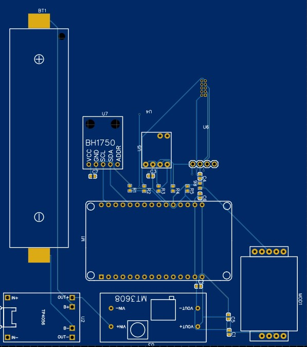

# 🟢 Battery-Powered ESP32 Indoor Air Quality Monitoring System

This project presents a low-cost, battery-operated indoor air quality monitoring system based on the ESP32 microcontroller. It integrates multiple digital and UART-based environmental sensors, powered efficiently from a single 18650 Li-ion cell.

---

## 🔋 Power Architecture

### Power Source
- **Battery:** 18650 Li-ion (3.7V nominal, 4.2V full, 3.0V cut-off)
- **Charging:** TP4056 module with built-in protection
- **Boost Conversion:** MT3608 boosts 3.7V to 5V
- **Regulation:**
  - **AMS1117-3.3** or **HT7333** steps 5V down to 3.3V for ESP32 and I²C sensors

| Stage                        | Voltage | Powers                                  |
|-----------------------------|---------|------------------------------------------|
| 18650 → TP4056 → MT3608     | 5V      | PMS7003, MH-Z19C, 3.3V regulator         |
| AMS1117-3.3 or HT7333       | 3.3V    | ESP32, SHT30, SGP30, BH1750              |

---

## 📶 UART Level Shifting

The ESP32 operates on 3.3V logic, while the MH-Z19C and PMS7003 sensors output 5V signals on TX. To protect the ESP32:

| Sensor     | TX → ESP32 RX | Level Shift Needed | Method                         |
|------------|---------------|--------------------|--------------------------------|
| PMS7003    | GPIO16 (RX2)  | Yes                | 20kΩ/10kΩ voltage divider      |
| MH-Z19C    | GPIO4 (RX1)   | Yes                | 20kΩ/10kΩ voltage divider      |
| ESP32 TX → Sensor RX | No shift needed (3.3V logic is accepted by 5V sensors) |

---

## 🧠 Microcontroller and Sensor Wiring

### ESP32 Pinout

- **UART2:** GPIO16 (RX2), GPIO17 (TX2) → PMS7003
- **UART1:** GPIO4 (RX1), GPIO5 (TX1) → MH-Z19C
- **I²C Bus:** 
  - SDA: GPIO21
  - SCL: GPIO22
  - Pull-ups: 4.7kΩ to 3.3V

### I²C Sensors (powered via 3.3V)
- **SHT30** – Temperature & Humidity
- **SGP30** – TVOC / eCO₂
- **BH1750** – Light/Lux

### UART Sensors (powered via 5V)
- **PMS7003** – PM2.5
- **MH-Z19C** – CO₂

---

## 🧰 Notes

- Add 100nF capacitors near each sensor’s VCC-GND for decoupling
- Place 10µF bulk caps on 5V and 3.3V rails
- Use GPIO control or pull-ups for PMS7003 SET and RESET pins (optional sleep control)
- Ensure good thermal and airflow design if enclosing sensors in a box

---

## 📁 Files Included

- `system_schematic.pdf` – Full wiring diagram and power plan
- `system_schematic.csv` – Project BOM (this file)
- `README.md` – Project documentation (this file)

---

## 💡 Future Improvements

- Add an OLED or LCD for local display
- Send data via Wi-Fi to cloud or local server
- Sleep modes for ESP32 to conserve power
- Enclosure with vents for proper sensor exposure

---

## 🖼️ System Schematic

Here is the full wiring diagram of the system:

---

## 🧪 License

This project is open for educational and DIY use. Attribution appreciated.  
Built with ❤️ by [Your Name / GitHub username]

---

